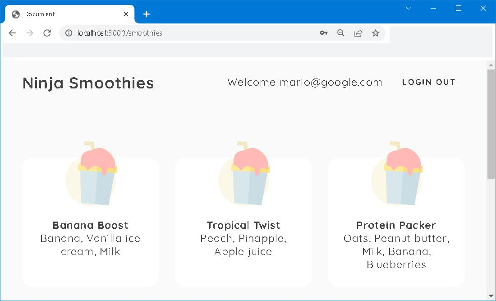

# node-express-jwt-auth


## Forward


## I. models/User.js
```javascript 
require('dotenv').config()
const mongoose = require('mongoose')
const { isEmail } = require('validator')
const bcrypt = require('bcrypt')

const userSchema = new mongoose.Schema({
    email: {
        type: String,
        required: [true, 'Please enter an email'],
        unique: true, 
        lowercase: true,
        validate: [isEmail, 'Please enter a valid email']
    },
    password: {
        type: String,
        required: [true, 'Please enter an password'],
        minlength: [6, 'Minimum password length is 6 characters']
    }
},
{ 
    timestamps: true
})

// MongoDB hook 
// Fire a function before doc saved to db
userSchema.pre('save', async function (next) {
    const salt = await bcrypt.genSalt()
    this.password = await bcrypt.hash(this.password, salt)
    next()
})

// static method to login user
userSchema.statics.login = async function (email, password) {
    const user = await this.findOne({ email })
    if (user) {
        const auth = await bcrypt.compare(password, user.password)
        if (auth) { return user }
        throw Error('incorrect password')    
    }
    throw Error('incorrect email')
}

const User = mongoose.model('User', userSchema)
module.exports = User
```

## II. controllers/authController.js
```javascript
require('dotenv').config()
const jwt = require('jsonwebtoken')
const User = require('../models/User')
const maxAge = process.env.JWT_MAX_AGE || 60 * 60 * 24 * 3 // default 3 days 

// handle errors
const handleErrors = (err) => {
    let errors = { email: '', password: ''}

    // incorrect email
    if (err.message === 'incorrect email') {
        errors.email = 'that email is not registered'
    }
    // incorrect password
    if (err.message === 'incorrect password') {
        errors.password = 'that password is incorrect'
    }
    // duplicated error code 
    if (err.code === 11000) {
        errors.email = 'That email is already registered'
        return errors
    }
    // validation errors 
    if (err.message.includes('user validation failed'))
    {
        Object.values(err.errors).forEach(({properties}) => {
            errors[properties.path] = properties.message
        })
    }
    return errors
}

function createToken(id) {
    return jwt.sign({ id }, process.env.JWT_TOKEN_SECRET, { expiresIn: maxAge })
}

module.exports.signup_get = (req, res) => {
    res.render('signup')
}
module.exports.login_get = (req, res) => {
    res.render('login')
}
module.exports.signup_post = async (req, res) => {
    const { email, password } = req.body
    try {
        const user = await User.create({ email, password})
        const token = createToken(user._id)
        res.cookie('jwt', token, { httpOnly: true, maxAge: maxAge })
        res.status(201).json({ user: user._id })
    }
    catch (err) {
        console.log(err)
        const errors = handleErrors(err)
        res.status(400).json({ errors })
    }
}
module.exports.login_post = async (req, res) => {
    const { email, password } = req.body
    
    try {
        const user = await User.login(email, password)
        const token = createToken(user._id)
        res.cookie('jwt', token, { httpOnly: true, maxAge: maxAge * 1000 })
        res.status(200).json({ user: user._id })
    }
    catch (err) {
        console.log(err)
        const errors = handleErrors(err)
        res.status(400).json({ errors })
    }
}

module.exports.logout_get = (req, res) => {
    res.cookie('jwt', '', { maxAge: 1})
    res.redirect('/')
}
```

## III. views/login.ejs
```html
<%- include('partials/header'); -%>

<form>
    <h2>Log in</h2>
    <label for="email">Email</label>
    <input type="text" name="email" required />
    <div class="email error"></div>
    <label for="password">Password</label>
    <input type="password" name="password" required />
    <div class="password error"></div>
    <button>Log in</button>
</form>

<script>
    const form = document.querySelector('form')
    const emailError = document.querySelector('.email.error')
    const passwordError = document.querySelector('.password.error')

    form.addEventListener('submit', async (e)=> {
        e.preventDefault()
        // reset errors 
        emailError.textContent = ''
        passwordError.textContent = ''
        
        // get the values 
        const email = form.email.value
        const password = form.password.value
        try {
            const res = await fetch('/login', {
                method: 'POST',
                body: JSON.stringify({ email, password }),
                headers: { "Content-Type": "application/json"}
            })
            const data = await res.json()
            console.log(data)
            if (data.errors) {
                emailError.textContent = data.errors.email
                passwordError.textContent = data.errors.password
            }
            if (data.user) {
                location.assign('/smoothies')
            }
        }
        catch (err)
        {
            console.log(err)
        }
    })
</script>

<%- include('partials/footer'); -%>
```

## IV. To put in work 
```bash
npm run dev
```
Navigate to <code>http://localhost:3000</code>


## V. To Round up





## VI. Reference
1. [Node Auth Tutorial (JWT)](https://youtu.be/SnoAwLP1a-0?list=PL4cUxeGkcC9iqqESP8335DA5cRFp8loyp)
2. [mongoose | Middleware](https://mongoosejs.com/docs/middleware.html)
3. [npm | validator](https://www.npmjs.com/package/validator)
4. [Cross Site Request Forgery (CSRF)](https://owasp.org/www-community/attacks/csrf)
5. [mdn web docs | location.replace()](https://developer.mozilla.org/en-US/docs/Web/API/Location/replace)
6. [The Narrative of Arthur Gordon Pym](https://www.eapoe.org/works/editions/pymbc.htm)

## VII. Appendix
.env file
```
# Server port 
PORT = 3000

# MongoDB
MONGODB_URI = "mongodb+srv://your_mongodb_server_url"

# JWT 
JWT_TOKEN_SECRET=4e7aa6a36a7d10cc2b1ac7332d9490fd7ca6217a8aa0b5c4731b8b26d6ba3011cc9a4d88f67b0470938c49dcf699b9f4fe0ea61e8fd9e7d8f4478b4025f0e6d0

JWT_MAX_AGE=60000
```

## EOF (2022/09/28)
