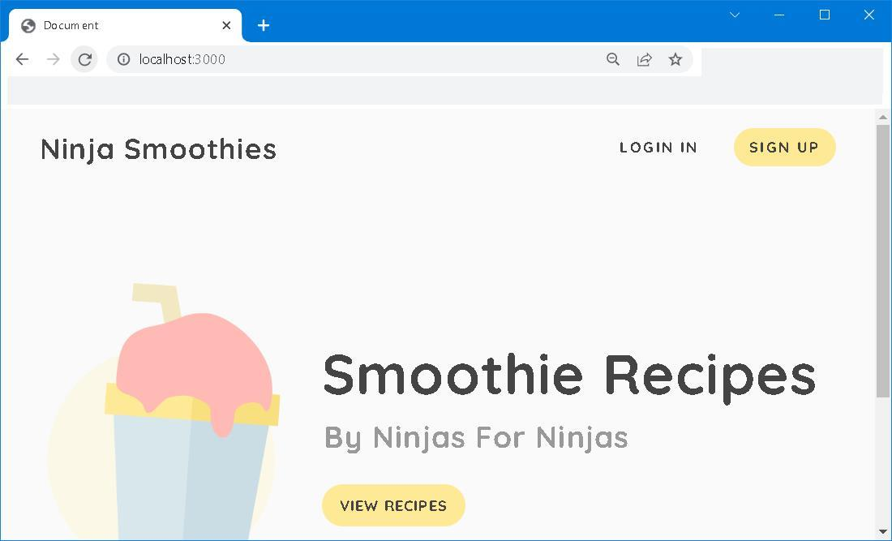

# node-express-jwt-auth


## Forward


## I. To prepare
package.json
```json
{
  "name": "node-express-jwt-auth",
  "version": "1.0.0",
  "description": "",
  "main": "app.js",
  "dependencies": {
    "bcrypt": "^5.0.1",
    "cookie-parser": "^1.4.6",
    "dotenv": "^16.0.2",
    "ejs": "^3.1.3",
    "express": "^4.17.1",
    "jsonwebtoken": "^8.5.1",
    "mongoose": "^5.9.23",
    "validator": "^13.7.0"
  },
  "scripts": {
    "test": "echo \"Error: no test specified\" && exit 1",
    "dev": "nodemon app"
  },
  "repository": {
    "type": "git",
    "url": "git+https://github.com/iamshaunjp/node-express-jwt-auth.git"
  },
  "keywords": [],
  "author": "",
  "license": "ISC",
  "bugs": {
    "url": "https://github.com/iamshaunjp/node-express-jwt-auth/issues"
  },
  "homepage": "https://github.com/iamshaunjp/node-express-jwt-auth#readme",
  "devDependencies": {
    "nodemon": "^2.0.20"
  }
}
```


## II. To put in work 
```bash
npm run dev
```


## III. To Round up




## IV. Reference
1. [Node Auth Tutorial (JWT)](https://youtu.be/SnoAwLP1a-0?list=PL4cUxeGkcC9iqqESP8335DA5cRFp8loyp)
2. [mongoose | Middleware](https://mongoosejs.com/docs/middleware.html)
3. [npm | validator](https://www.npmjs.com/package/validator)
4. [Cross Site Request Forgery (CSRF)](https://owasp.org/www-community/attacks/csrf)
5. [mdn web docs | location.replace()](https://developer.mozilla.org/en-US/docs/Web/API/Location/replace)
6. [The Narrative of Arthur Gordon Pym](https://www.eapoe.org/works/editions/pymbc.htm)

## V. Appendix
.env file
```
# Server port 
PORT = 3000

# MongoDB
MONGODB_URI = "mongodb+srv://your_mongodb_server_url"

# JWT 
JWT_TOKEN_SECRET=4e7aa6a36a7d10cc2b1ac7332d9490fd7ca6217a8aa0b5c4731b8b26d6ba3011cc9a4d88f67b0470938c49dcf699b9f4fe0ea61e8fd9e7d8f4478b4025f0e6d0

JWT_MAX_AGE=60000
```

## EOF (2022/09/28)